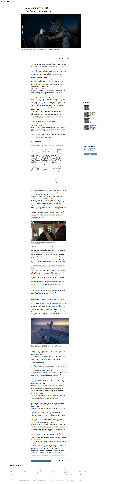

# Project: HTML/CSS Positioning and Float ([NYT Space Big Bang](http://www.nytimes.com/2014/03/18/science/space/detection-of-waves-in-space-buttresses-landmark-theory-of-big-bang.html?_r=0))

This is the second project of the Main HTML/CSS curriculum at [Microverse](https://www.microverse.org/) - @microverseinc
* The goal was learn about postioning and floating elements by recreating a NYT Space page. 
* The project was completed using HTML and CSS by positioning and floating elements with CSS

#### [Assignment link](https://www.theodinproject.com/courses/html5-and-css3/lessons/positioning-and-floating-elements)

#### [View in broswer](https://rawcdn.githack.com/codingAngarita/nytimes-article-copy/0c8ab1f7eb9d3b9b2bcae3316470a5bd62b9938b/index.html)

#### Live ScreenShot of the page

#### Authors

* [@lilleonz](https://github.com/lilleonz)
* [@codingAngarita](https://github.com/codingAngarita)
